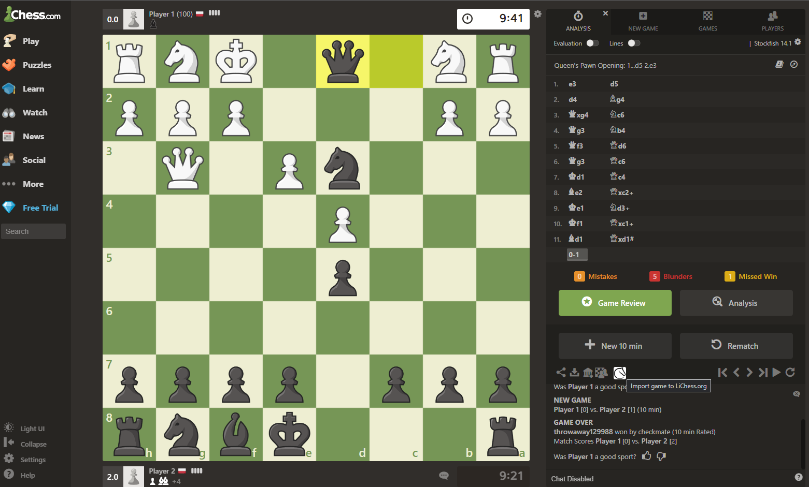
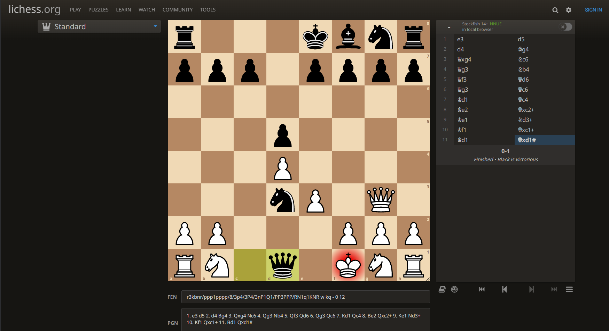

# Li-Chess.com

Import your [chess.com](https://chess.com) game to the [lichess.org](https://lichess.org) analysis tool!

## How Does It Work

After the extension is installed, any game (archived or live, but only after it has ended) may be imported over to the LiChess analysis tool with a click of a button.

The button is rendered next to the post-game button tray, as presented below:

After the button is clicked, the lichess analysis tool opens in a new tab:

